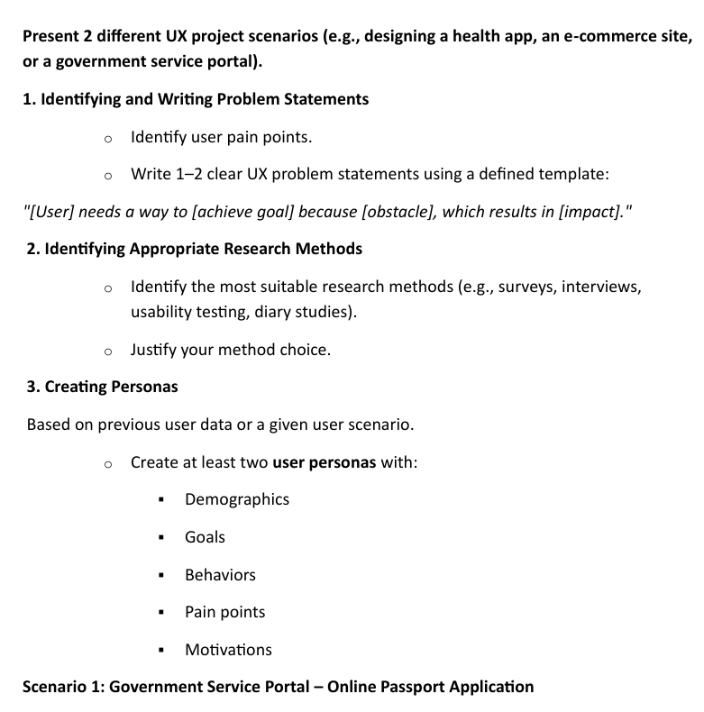
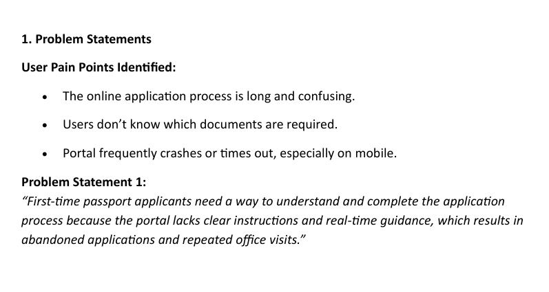
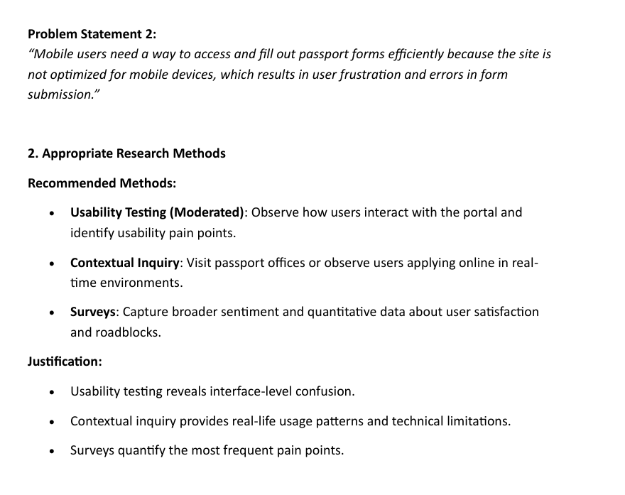
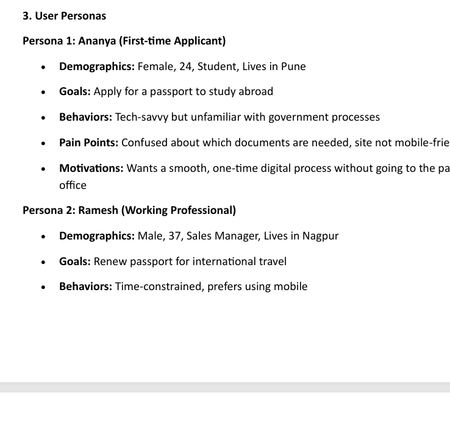
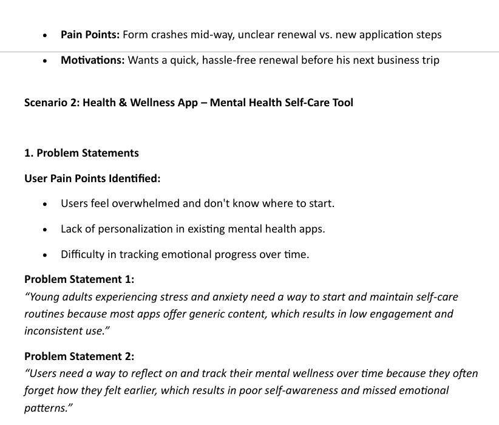
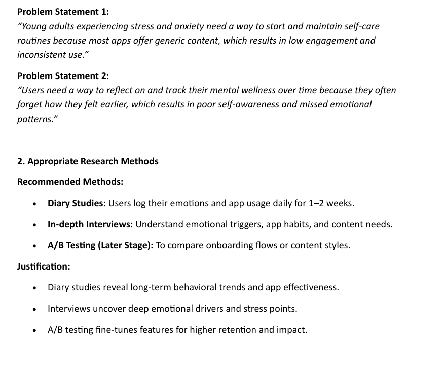

# UI-and-UX-Exp-5

```
Present 2 different UX project scenarios (e.g., designing a health app, an e-commerce site, or a government service portal).

1. Identifying and Writing Problem Statements

Identify user pain points.
Write 1–2 clear UX problem statements using a defined template:
"[User] needs a way to [achieve goal] because [obstacle], which results in [impact]."

 2. Identifying Appropriate Research Methods

Identify the most suitable research methods (e.g., surveys, interviews, usability testing, diary studies).
Justify your method choice.
 3. Creating Personas

 Based on previous user data or a given user scenario.

Create at least two user personas with:
Demographics
Goals
Behaviors
Pain points
Motivations

```










